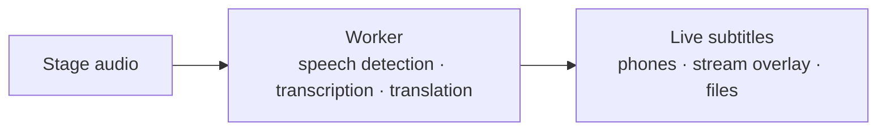

<p align="center">
  <picture>
    <source media="(prefers-color-scheme: dark)" srcset="docs/assets/conffy-banner-dark.png">
    
  </picture>
</p>

<p align="center">
  <b>Conffy — Your conference buddy · Live subtitles for every stage.</b><br>
  Real-time transcription &amp; translation for multi-stage conferences
</p>

---

Conffy turns the audio of every stage of a conference into **live subtitles**,
in the original language and translated, that anyone in the room can follow on
their phone. No app to install and no special headsets. It is open source,
runs fully local on a single Mac, and scales by adding one session per stage.

> **En español:** Conffy genera subtítulos en vivo de cada charla, transcriptos
> y traducidos, para que cualquier asistente los siga desde el celular. Corre
> 100% local y escala sumando una sesión por escenario.

<p align="center">
  <picture>
    
  </picture>
</p>
<p align="center">
  <b>Conffy nació en la Vibeathon de Nerdearla 2026</b>
</p>

## What it does



Each stage's audio is cut into sentences. Whisper transcribes them and Gemma
translates them, both running locally. The subtitles reach every viewer in
about 1 s in the original language and ~2 s translated. Out of the box it
translates **English ⇄ Spanish**; other languages are configuration.

### Inputs

| Source | How |
|---|---|
| The stage's mixing desk or a microphone | a laptop with an audio input (`make mic`), or a hardware encoder: [docs/WEB.md](docs/WEB.md) |
| OBS / vMix | stream to the built-in media server (RTMP): [docs/OBS.md](docs/OBS.md) |
| Live streams | any URL ffmpeg reads (RTMP, SRT, RTSP, HLS, HTTP), including YouTube live |
| Recordings | audio or video files, to subtitle talks after the fact |

### Outputs

| Output | For |
|---|---|
| **Web viewer** | the audience: pick a room and a language on the phone, adjust the text size |
| **Stream overlay** | burning subtitles into the OBS / vMix video: [docs/OBS.md](docs/OBS.md) |
| **Transcripts** | SRT, VTT or TXT files per talk and language, e.g. for YouTube |
| **Production panel** | the team running the event: status, latency and errors per room |
| **HTTP API + live stream (SSE)** | integrations: [docs/API.md](docs/API.md) |
| **Terminal** | quick tests and tuning: [docs/CLI.md](docs/CLI.md) |

## Quick start (macOS, Apple Silicon)

**Requirements:**

- [Homebrew](https://brew.sh)
- [Docker Desktop](https://www.docker.com/products/docker-desktop/) or [OrbStack](https://orbstack.dev)
- [uv](https://docs.astral.sh/uv/) (`brew install uv`)
- ~12 GB of disk for the models

No API keys or accounts are needed.

```bash
git clone <this repo> conffy && cd conffy
chmod +x scripts/*.sh

./scripts/setup-host.sh   # once: installs whisper.cpp, Ollama, ffmpeg and the models, then tests them
./scripts/run-host.sh     # starts the models on the Mac's GPU (keep this terminal open)

make up                   # in another terminal: the whole stack in Docker
```

Open **http://localhost:8080**. Two demo talks are already live: pick one and
choose EN or ES. The production panel will be at http://localhost:8080/admin.html (NEXT FEATURE).

- **To receive OBS, vMix or microphone streams:** start the stack with
  `make up-obs` instead of `make up`.
- **To try it without downloading models:** `make demo-nomodels` runs
  everything with simulated models.
- **To try it without Docker:**
  `uv run python -m conffy.worker.cli samples/charla.mp3 --glossary nerdearla`
  prints live subtitles in the terminal.

The models run natively on the Mac because Docker on macOS can't use the GPU.
Everything else runs in containers.

## Documentation

| Document | What it covers |
|---|---|
| [docs/WEB.md](docs/WEB.md) | From the stage's mixer to subtitles on phones, without OBS |
| [docs/OBS.md](docs/OBS.md) | Sending audio from OBS and burning subtitles into any video |
| [docs/CLI.md](docs/CLI.md) | Terminal subtitles, every option, and the Makefile shortcuts |
| [docs/API.md](docs/API.md) | HTTP endpoints, data models and the live caption stream |
| [docs/MODELS.md](docs/MODELS.md) | Swapping models and providers: local, GPU servers, Gemini |
| [docs/SCALING.md](docs/SCALING.md) | Measured capacity and the plan for 15+ stages |
| [docs/CONTRACTS.md](docs/CONTRACTS.md) | How the components talk to each other (for developers) |
| [docs/COMO-FUNCIONA.md](docs/COMO-FUNCIONA.md) | The whole system explained step by step, in Spanish |
| [docs/ROADMAP.md](docs/ROADMAP.md) | What comes next |
| [CONTRIBUTING.md](CONTRIBUTING.md) | How to contribute |

## Numbers

Measured on a Mac mini M4 Pro (details in [docs/SCALING.md](docs/SCALING.md)):

- **Latency:** subtitles arrive ~1 s after the speaker pauses in the
  original language, and ~2 s translated.
- **Viewers:** 1,500 simultaneous viewers over 15 talks, with 0 failed
  connections and delivery in under 20 ms (p95).
- **Talks per machine:** 2 live talks comfortably on one Mac. For more,
  add machines, GPU servers or hosted models.

## Troubleshooting

- **No subtitles, and `ConnectError` in `make logs`:** the containers can't
  reach the models. Restart them with `BIND_HOST=0.0.0.0 ./scripts/run-host.sh`.
- **Ollama was already open as a desktop app:** quit it before `run-host.sh`.
- **Names are misheard or badly translated:** add them to `config/glossary.yml`.
- **A talk shows "Interrumpida":** check `make logs`, fix the source, then
  `make start ID=<talk id>`.

## License

[Apache License 2.0](LICENSE). Contributions are welcome: see [CONTRIBUTING.md](CONTRIBUTING.md).

Built on [whisper.cpp](https://github.com/ggml-org/whisper.cpp),
[Gemma](https://ai.google.dev/gemma), [Ollama](https://ollama.com),
[Silero VAD](https://github.com/snakers4/silero-vad),
[Valkey](https://valkey.io), [MediaMTX](https://github.com/bluenviron/mediamtx)
and [FastAPI](https://fastapi.tiangolo.com). Made for the
[Nerdearla](https://nerdear.la) 2026 Vibeathon.