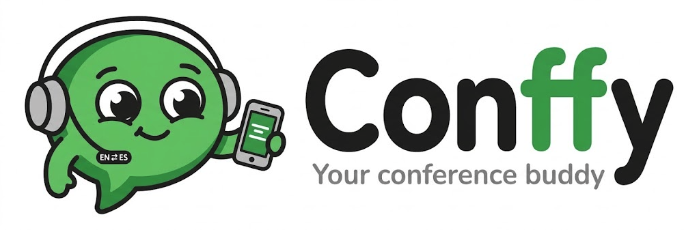

<p align="center">
  <picture>
    <source media="(prefers-color-scheme: dark)" srcset="docs/assets/conffy-banner-dark.png">
    
  </picture>
</p>

<p align="center">
  <b>Live subtitles for every stage.</b><br>
  Real-time transcription &amp; translation for multi-stage conferences · English ⇄ Español
</p>

---

Para permitir la ejecucion de scripts:
```bash
chmod +x scripts/*.sh
```

Para realizar el setup en MacOS (Silicon) - instala dependencias, baja modelos, prueba:
```bash
./scripts/setup-host.sh
```

Para levantar ollama y whisper:
```bash
./scripts/run-host.sh
```

Instala dependencias y levanta venv:
```bash
uv sync
```

Ejecutar test:
```bash
uv run pytest
```

Ejecutar worker con archivo sample:
```bash
uv run python -m conffy.worker.cli samples/jfk.wav
```

Ejecutar worker con archivo sample largo usando un glosario:
```bash
uv run python -m conffy.worker.cli samples/charla.mp3 --glossary nerdearla
```