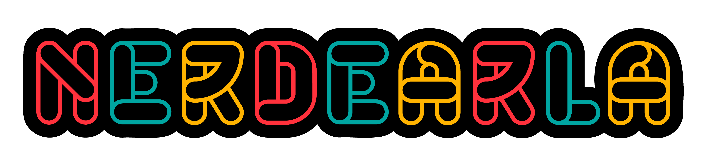
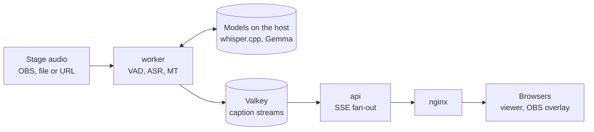

<p align="center">
  <picture>
    <source media="(prefers-color-scheme: dark)" srcset="docs/assets/conffy-banner-dark.png">
    
  </picture>
</p>

<p align="center">
  <b>Conffy — Your conference buddy - Live subtitles for every stage.</b><br>
  Real-time transcription &amp; translation for multi-stage conferences
</p>

---

Conffy turns the audio of every stage of a conference into live subtitles, in
the original language and translated, that anyone in the room can follow on
their phone. It is open source, runs fully local on a single Mac, and is
designed to scale to many parallel stages.

> **En español:** Conffy genera subtítulos en vivo de cada charla, transcriptos
> y traducidos, para que cualquier asistente los siga desde el celular. Corre
> 100% local y está pensado para escalar a muchos escenarios en paralelo.
> Construido en la Vibeathon de Nerdearla 2026.

<p align="center">
  <picture>
    
  </picture>
</p>
<p align="center">
  <b>Conffy — Your conference buddy nacio en la Vibeathon de Nerdearla 2026</b><br>
</p>

## Features

- **Live transcription** of English or Spanish talks with Whisper (whisper.cpp).
- **Live translation** EN → ES and ES → EN with Gemma 4 (via Ollama), aware of
  the previous sentences so fragments are translated faithfully.
- **Many stages at once:** each talk is a session handled by its own worker;
  add workers to add stages.
- **Audience web app:** choose a talk and a language, read subtitles live,
  adjust text size, download the transcript. No install, no login.
- **OBS / vMix overlay** to burn subtitles into the stream.
- **Glossaries** per event, so names and jargon ("Kubernetes", "Goodhart's
  Law") are recognized and translated consistently.
- **Transcript export** as SRT, VTT or plain text.
- **Resilient:** if a worker dies mid-talk, another one resumes it in seconds;
  viewers reconnect and catch up without gaps.
- **Swappable AI:** transcription and translation sit behind interfaces. Change
  the model or provider with environment variables.

## How it works



1. A **worker** claims a talk, reads its audio with ffmpeg and splits it into
   sentences with a voice activity detector (Silero VAD).
2. Each sentence is transcribed by **Whisper**. While the speaker is still
   talking, provisional text is shown and later replaced by the final one.
3. Final sentences are translated by **Gemma**, with the previous sentences as
   context and the event glossary.
4. Captions are written to **Valkey** streams, one per talk and language.
5. The **api** reads each stream once and pushes it to every connected browser
   over Server-Sent Events. Browsers that reconnect resume where they left off.

Translation costs grow with talks × languages, never with the number of
viewers.

## Quick start (macOS, Apple Silicon)

Requirements: [Homebrew](https://brew.sh),
[Docker Desktop](https://www.docker.com/products/docker-desktop/) or
[OrbStack](https://orbstack.dev), and [uv](https://docs.astral.sh/uv/)
(`brew install uv`). About 12 GB of disk for the models.

The AI models run natively on the Mac to use the GPU (Docker on macOS cannot
access it). Everything else runs in containers.

```bash
git clone <this repo> conffy && cd conffy
chmod +x scripts/*.sh

# 1. Once: install whisper.cpp, Ollama and ffmpeg, download the models, run a smoke test
./scripts/setup-host.sh

# 2. Start the models (keep this terminal open)
./scripts/run-host.sh

# 3. In another terminal: start the stack
docker compose up --build -d
```

Open **http://localhost:8080**. Two demo talks are already live: pick one and
choose EN or ES.

No API keys or accounts are needed: everything runs locally.

### Try it without downloading models

`make demo-nomodels` starts the whole stack with simulated models: the text is
a sample transcript, and translations are marked as `[es] ...`. It is useful to
explore the app, the API and the load test on any machine with Docker.

### Try it in the terminal first

Handy to check the models and to tune glossaries, without Docker:

```bash
uv sync
uv run python -m conffy.worker.cli samples/jfk.wav
uv run python -m conffy.worker.cli samples/charla.mp3 --glossary nerdearla
uv run python -m conffy.worker.cli samples/charla.mp3  --glossary nerdearla
uv run python -m conffy.worker.cli samples/charla_es.mp3 --lang es --to en --glossary nerdearla
```

## Configuration

### Talks: `config/sessions.yml`

Talks are created when the api starts (existing ones are not modified).

```yaml
sessions:
  - id: sala-a                      # lowercase slug, used in URLs
    title: "KPIs, presión y burnout"
    source: {kind: file, uri: samples/charla.mp3, loop: true}
    source_lang: en
    target_langs: [es]
    glossary: nerdearla

  - id: escenario-principal         # live stream from OBS (see below)
    title: "Escenario principal"
    source: {kind: url, uri: "rtmp://mediamtx:1935/escenario-principal"}
    source_lang: es
    target_langs: [en]
```

`source.kind` can be `file` (a path in the repo), or `url` (anything ffmpeg
reads: RTMP, SRT, RTSP, HLS, HTTP).

Talks can also be managed through the API:

| Method | Path | Purpose |
|---|---|---|
| `GET` | `/api/sessions` | list talks with live status and latencies |
| `POST` | `/api/sessions` | create a talk (same fields as the YAML) |
| `POST` | `/api/sessions/{id}/stop` | stop a talk |
| `POST` | `/api/sessions/{id}/start` | start a stopped or failed talk again |
| `GET` | `/api/sessions/{id}/captions/{lang}/stream` | live captions (SSE) |
| `GET` | `/api/sessions/{id}/export.srt?lang=es` | transcript as SRT, VTT or TXT |

### Glossaries: `config/glossary.yml`

```yaml
nerdearla:
  keep:                    # never translated; also helps Whisper recognize them
    - Kubernetes
    - Goodhart
  translate:               # fixed translations per target language
    es:
      Goodhart's Law: ley de Goodhart
      deploy: despliegue
```

### AI providers and models

Set in `.env` (copy `.env.example`) or as environment variables:

| Variable | Default | Notes |
|---|---|---|
| `ASR_PROVIDER` | `whispercpp` | transcription adapter |
| `ASR_URL` | `http://host.docker.internal:8081` | whisper-server |
| `MT_PROVIDER` | `openai_compat` | any OpenAI-compatible API: Ollama, vLLM, llama.cpp, LM Studio, hosted providers |
| `MT_URL` | `http://host.docker.internal:11434/v1` | |
| `MT_MODEL` | `gemma4:e4b` | e.g. `gemma4:12b` for higher quality, slower |
| `MT_API_KEY` | empty | only for hosted providers |

Adding a provider means writing one adapter class; see `docs/CONTRACTS.md`.

## Streaming integration (OBS / vMix)

**Burn subtitles into the stream:** add a *Browser* source in OBS with
`http://localhost:8080/overlay.html?s=sala-a&lang=es` (1920 × 1080). The
background is transparent. Options: `&size=48`, `&lines=2`, `&partials=0`.

**Send a stage's audio to conffy:** start the stack with MediaMTX
(`docker compose --profile rtmp up -d`), point OBS to
`rtmp://<host>:1935/<talk-id>`, and use `rtmp://mediamtx:1935/<talk-id>` as
the talk's source URL.

## Scaling

```bash
docker compose up -d --scale worker=4    # 4 talks at the same time
```

- **More talks** need more workers (cheap: ~3% of a core each) and, above
  all, more model capacity. One M4 Pro handles 2 live talks comfortably. Move
  the models to more machines or GPU servers; only `ASR_URL` / `MT_URL` change.
- **More viewers** need more api replicas behind nginx. Each replica reads
  every stream once, whatever the number of viewers; 1,500 viewers used ~1%
  CPU per replica.
- **Production** (15+ stages): Kubernetes with workers scaled by the number of
  live talks, a GPU pool serving Whisper and Gemma (or hosted providers), and
  managed Valkey. See [docs/SCALING.md](docs/SCALING.md).

## Performance

Measured on a Mac mini M4 Pro (48 GB) with Whisper large-v3-turbo (q5_0) and
Gemma 4 e4b. Full details in [docs/SCALING.md](docs/SCALING.md).

**Latency of one talk**

| Stage | Latency |
|---|---|
| Transcription per sentence | ~0.6 s |
| Translation per sentence | ~0.6–1.2 s |
| Original-language subtitle after the speaker pauses | ~1 s |
| Translated subtitle after the speaker pauses | ~2 s |

**Viewers:** 1,500 simultaneous viewers over 15 talks, 0 failed connections,
subtitle delivery p50 8.6 ms and p95 19.9 ms, with each api replica at ~1%
CPU. Reproduce it with `make loadtest-up && make loadtest`; it needs no GPU.

**Talks per machine:** one M4 Pro runs 2 live talks comfortably (lag ≤1.7 s)
and 3 at the limit (~4–5 s). Whisper and Gemma share the GPU, so more talks
need more GPU capacity: more machines, GPU servers or hosted models.

## Development

```bash
uv sync                    # dependencies
uv run pytest              # tests (Valkey tests run if TEST_VALKEY_URL points to one)
make logs                  # api and worker logs
make reset                 # wipe all talks and captions
```

```
src/conffy/contracts.py    data models, AI interfaces, Valkey keys
src/conffy/worker/         audio, VAD, transcription, translation, session runner
src/conffy/api/            REST, SSE fan-out, exports
src/conffy/providers/      AI adapters (whisper.cpp, OpenAI-compatible)
web/                       audience app and OBS overlay (no build step)
config/                    talks and glossaries
```

More documentation:

- [docs/CONTRACTS.md](docs/CONTRACTS.md): how the pieces talk to each other.
- [docs/MODELS.md](docs/MODELS.md): swapping models and providers (local, GPU servers, Gemini).

## Troubleshooting

- **No subtitles, and `ConnectError` in `make logs`:** the containers cannot
  reach the models. Restart them with `BIND_HOST=0.0.0.0 ./scripts/run-host.sh`.
- **Ollama was already open as a desktop app:** quit it before
  `run-host.sh`, so the script can start Ollama with parallel requests enabled.
- **Names are misheard or badly translated:** add them to the glossary.
- **Workers use a lot of CPU in Docker:** keep `OMP_NUM_THREADS=1` and
  `OMP_WAIT_POLICY=PASSIVE` (already set in `docker-compose.yml`). Without them
  the voice detector's threads spin and burn ~half a core each.
- **A talk shows "Interrumpida":** check `make logs`, fix the source, then
  `curl -X POST localhost:8080/api/sessions/<id>/start`.

## License

[Apache License 2.0](LICENSE).

Built on [whisper.cpp](https://github.com/ggml-org/whisper.cpp),
[Gemma](https://ai.google.dev/gemma), [Ollama](https://ollama.com),
[Silero VAD](https://github.com/snakers4/silero-vad),
[Valkey](https://valkey.io), [FastAPI](https://fastapi.tiangolo.com) and the
[Atkinson Hyperlegible](https://www.brailleinstitute.org/freefont/) typeface.
Made for the [Nerdearla](https://nerdear.la) 2026 Vibeathon.