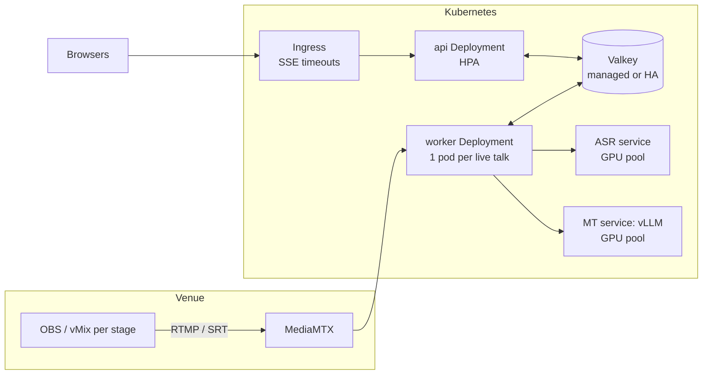

# Scaling conffy

How conffy goes from one laptop to a whole conference: 15 stages at once, with
~100 viewers each, in English and Spanish.

**Summary:** viewers are cheap and talks are expensive. Delivering subtitles
to 1,500 browsers costs almost nothing. Transcribing and translating 15 live
talks needs dedicated GPU capacity. The code does not change between one
laptop and production; only configuration and infrastructure do.

## What scales with what

| Grows with | Component | Cost |
|---|---|---|
| **Viewers** | api replicas and nginx: SSE fan-out | tiny: each replica reads every stream once, whatever the number of viewers |
| **Talks** | workers: audio decoding and voice detection | small: ~3% of a CPU core per talk |
| **Talks × languages** | ASR and MT models | **large**: GPU time; this is where the budget goes |
| Talks × languages × duration | Valkey memory | small: capped streams, a few MB per stream |

## Measured baseline

All measured on one Mac mini M4 Pro (48 GB) running the docker compose stack.

### 1. Delivery to viewers (fake models, `make loadtest-up` + `make loadtest`)

15 talks, 30 caption streams, 15 workers, 3 api replicas, 1,500 simultaneous
SSE viewers, 2 minutes:

| Metric | Result |
|---|---|
| Connections failed / dropped | 0 / 0 |
| Captions delivered | ~790 per second (95,000 samples) |
| Delivery delay, worker → browser | p50 **8.6 ms**, p95 **19.9 ms**, p99 268 ms, max 975 ms |
| CPU per api replica / nginx / Valkey | ~1% / ~2% / <1% |
| CPU per worker (VAD + ffmpeg) | 2.5–5% of one core |
| Memory per api replica / worker / Valkey | ~64 MB / ~44 MB / ~15 MB |

The p99 tail is likely the single-process load generator and Docker Desktop's
port forwarding; it was not investigated further. Either way, delivery is under
1% of the end-to-end latency, which is dominated by the models (1–3 s).

### 2. Live talks with real models (`make watch`)

whisper.cpp large-v3-turbo (q5_0) and Gemma 4 e4b via Ollama, both on the
Mac's GPU. Each talk is English with Spanish translation:

| Live talks | ASR per call | MT per call | Subtitle lag | Verdict |
|---|---|---|---|---|
| 1 | ~650 ms | ~640 ms | 1.1 s | comfortable |
| 2 | 0.6–1.3 s | 0.2–0.7 s | 1.4 s (max 1.7) | **comfortable** |
| 3 | 1.5–2.6 s | 3.3–5.5 s | 4.4 s (max 5.1) | at the limit |
| 4 | ~3.8 s | 3.3–12 s | 5.5 s (max 8.6), growing | saturated |

**One M4 Pro sustains 2 live talks comfortably, 3 at the edge.** ASR and MT
latencies degrade together because both models share one GPU. Running more
whisper-server instances on the same machine would not help: the limit is GPU
time, not the request queue.

## Capacity math

Per second of speech, one talk needs roughly:

- **ASR:** one final transcription per utterance (~0.6 s every 3–4 s), plus
  partials. Partials are capped at 50% of the ASR time and back off
  automatically when the model is slow. That comes to about 0.3–0.5 s of GPU
  per second on the M4 Pro.
- **MT:** one translation per final sentence and target language (~0.6–1.2 s
  every 3–4 s). That is about 0.2–0.3 s of GPU per second per language.

That adds up to ~0.5–0.8 GPU-seconds per second per talk on this GPU, so about
1.5–2 talks per M4 Pro, which matches the measurement.

For **15 talks with one translation each**:

- **Local-first:** ~8 Mac mini M4 Pro (2 talks each), or equivalent Apple
  Silicon machines at the venue.
- **Data-center GPUs:** servers that *batch* requests amortize the fixed cost
  of each call, which the Mac pays on every request.
  - ASR: faster-whisper or a whisper.cpp server with batched inference.
  - MT: vLLM with continuous batching serving Gemma.

  The number of GPUs has to be measured on the chosen hardware. The procedure
  is the same `make watch` ramp: add talks until the lag keeps growing.
- **Hosted APIs** (Gemini, planned provider): no GPUs to operate; cost scales
  per audio minute.

Viewers barely change the math. At about 0.5 captions per second per viewer
(~0.3 KB/s), 1,500 viewers need well under 1 MB/s of bandwidth. Two api
replicas are enough; a third is for high availability.

## Production architecture (Kubernetes)

### Component by component

- **api:** a Deployment of 2–3 replicas with an HPA on CPU or open connections.
  The Ingress needs long read timeouts and buffering off for
  `/api/sessions/*/captions/*/stream`, the same settings as
  `deploy/nginx/nginx.conf`.
- **workers:** one pod per live talk; each needs ~0.05 CPU and ~50 MB. A
  conference has a published agenda, so the simplest reliable autoscaling is
  a **KEDA cron scaler** following the schedule, with a couple of spare pods.
  Spare pods cost almost nothing and make failover instant. The lease
  already guarantees that one pod owns one talk, and that another pod resumes
  a talk if its owner dies (measured: ~10 s).
- **Models:** a separate GPU node pool behind internal Services.
  - MT: vLLM exposes an OpenAI-compatible API, so the existing
    `openai_compat` adapter works by changing `MT_URL`.
  - ASR: point `ASR_URL` to a whisper.cpp server pool, or add a small adapter
    for OpenAI-compatible transcription servers (e.g. faster-whisper based).
  - Scale on GPU utilization or queue depth.
- **Valkey:** managed, or Valkey with a replica and AOF. Streams are capped
  (`MAXLEN ~ 50,000` per talk and language). At ~350 bytes per entry, that is
  at most ~17 MB per stream and ~0.5 GB for 30 streams in the worst case.
- **Audio ingest:** MediaMTX at the venue or in the cluster. Each talk's
  `source.uri` points to its RTMP or SRT path.

### What changes from docker compose

| Changes | Stays the same |
|---|---|
| nginx → Ingress | all application code |
| `docker compose --scale` → Deployments, HPA, KEDA | caption contracts, Valkey keys, SSE protocol |
| host models → GPU services (`ASR_URL`, `MT_URL`) | the provider interfaces |
| Valkey container → managed Valkey | lease-based failover |

Small code changes that production would want (see `docs/ROADMAP.md`):
viewer counts aggregated across replicas, an ASR adapter for
OpenAI-compatible transcription servers, and retries for failed URL sources.

## Failure modes

| Failure | Effect | Recovery |
|---|---|---|
| Worker dies | captions for that talk pause | another worker takes the lease in ≤10 s and continues the numbering and timeline |
| api replica dies | its viewers disconnect | browsers reconnect in 2 s to another replica and resume from `Last-Event-ID`, without gaps |
| ASR or MT unavailable | captions pause; errors are counted | the session keeps running; captions resume when the model is back |
| Model saturated | subtitles fall behind; partials back off first | add GPU capacity, or reduce load (see below) |
| Valkey restart | brief interruption | AOF restores sessions and captions (≤1 s of data lost) |

## Getting more from one machine

Each of these trades some quality for capacity. None is enabled by default.

- **Fewer partials:** partials are up to half of the ASR load. Showing only
  final sentences roughly halves ASR time, at the cost of a less "live" feel.
- **Smaller encoder window:** `whisper-server -ac 768` processes 15 s windows
  instead of 30 s. Utterances never exceed 15 s, so this cuts the fixed cost of
  every call, with a possible small accuracy loss.
- **Smaller models:** Gemma 4 e2b for MT, or a smaller Whisper. Faster, lower quality.
- **Hosted providers** for some talks: mix local and hosted per session.